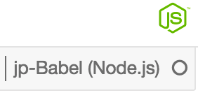

# Machine Learning In Javascript

Materials for the Machine Learning in Javascript Workshop by Expero inc

Given at the [M3 Machine Learning Conference, London, Oct 2017](http://www.mcubed.london/sessions/workshop-introduction-to-machine-learning-with-javascript/)

## Getting Setup

The majority of the course will be run in Jupyter notebooks. Jupyter is a REPL like interface embedded in a web page which is good for experimentation and exploratory development. It's very popular in the python and data science communities, so is also a good stepping stone into other ecosystems.

Using it means we need to install a python distribution even though we are working in javascript. 

If you are learning ML *some* python is likely in your future. So we can maybe live with tha and after this course go find and experiment with some of the technqiues you will learn here in other toolsets.

### Installing python and the notebook kernel

 1. Install an IPython distribution
   - I recomend installing [Anaconda 3.6](https://www.anaconda.com/download/) it is heayweight but that is the distibution I have tested with and if you are interested in moving on apply some of the things you have learnt after the conference in python too, then this is a good starting point.
 2. Install [node.js](https://nodejs.org/en/) we are using v8.5.x.
   - If you already have node installed and don't want to mess with your local environment, then install `nvm` and install node v8.5.x from there. 
     - on Mac [nvm](https://github.com/creationix/nvm/blob/master/README.md)
     - on Windows [nvm-windows](https://github.com/coreybutler/nvm-windows)
 3. Install the `jp-babel` variant of the IJavascript kernel
    - `npm install -g jp-babel`
    - if you are running on linux check out the instructions on [this page](http://n-riesco.github.io/ijavascript/doc/install.md.html)
 4. Install Javascript dependencies
   - run `npm install` in the repo root folder :)
 5. Start the notebook
   - run `jp-babel-notebook` in the repo root folder
   - a web browser should pop up showing the Jupyter browser / tree view of the current folder.
 6. From Jupyter, open the [smoke test notebook](0_smoke_test.ipynb)
   - When the notebook opens you should be able to see the `jp-babel` javascript kernel loaded in the top right corner.

     

   - If not, go to `Kernel Menu` > `Change Kernel` and select the `jp-babel` option and follow the prompts.
   - In the `Cell Menu`, select `Run All`. Each cell should execute and if all dependencies are properly installed we shouldn't see any errors.

### Run in docker

  1. docker build --tag=ml/ml . 
    - please note that it downloads the original github repository, not the local files
  2. docker run --name ml1 -d -v <path to your nodebooks>:/data ml/ml
    - the link to the jupyter can be seen in the logs with `docker logs ml1`
